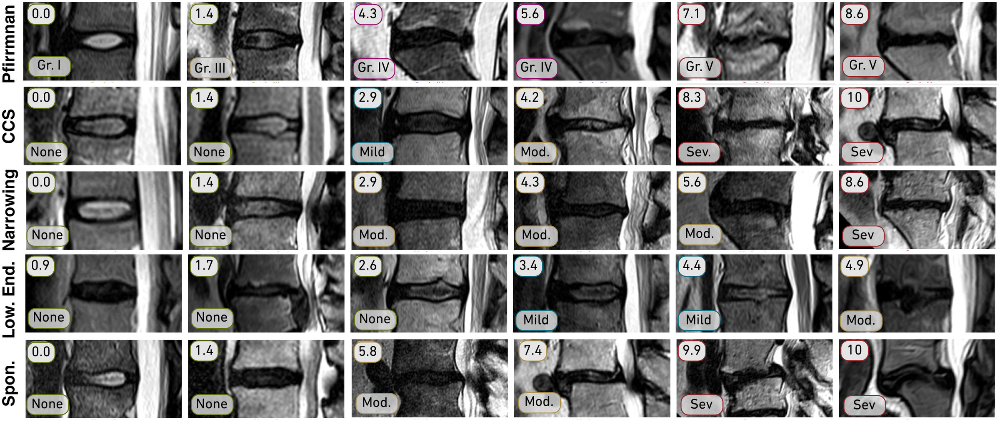

<div align="center">

# SpineRankNet

### Be Indiscrete: The Benefits of Learning Continuous Spine Degeneration Severity Scores

**MICCAI 2026**

Maria Monzon<sup>1,2</sup>, Andrew Zisserman<sup>3</sup>, Robin Y. Park<sup>3</sup>, Catherine R. Jutzeler<sup>1,2</sup>, Amir Jamaludin<sup>3</sup>

<sup>1</sup> ETH Zurich &nbsp; <sup>2</sup> Swiss Institute of Bioinformatics &nbsp; <sup>3</sup> University of Oxford

[](https://spinetools.github.io/spineranknet/)
[](#citation)
[](LICENSE)
[](pyproject.toml)

</div>

<p align="center">
  
</p>

SpineRankNet learns a **continuous severity score in [0, 10]** for each of 11 lumbar-spine MRI grading tasks from pairwise comparisons, using a severity-aware ranking loss. Thresholds on the score recover the clinical grade. On the multi-centre Genodisc cohort it gives the best ordinal agreement (QWK 0.76, MAE 0.14) at the same ROC-AUC as a cross-entropy classifier (0.94), and it orders cases within a grade. See the [project page](https://spinetools.github.io/spineranknet/) for the method and results.

## Installation

Python ≥ 3.10. Training needs an NVIDIA GPU; install the PyTorch build for your CUDA version first ([pytorch.org](https://pytorch.org/get-started/locally/)).

```bash
git clone https://github.com/spinetools/spineranknet.git
cd spineranknet
pip install -e ".[corn]"
```

This puts the trainer on your `PATH` as `spineranknet-train`. To use only the library (losses, heads, encoders): `pip install "spineranknet[corn] @ git+https://github.com/spinetools/spineranknet.git"`.

## Data

No imaging data or labels are included. The experiments use the **Genodisc** cohort, which is not publicly available; access is governed by the Genodisc consortium. The trainer expects this layout:

```text
$GENODISC_ROOT/                  # default: data/GENODISCv2
├── geno_ivd_v1.pkl              # {"Train"|"Val"|"Test": {<ivd key>: {"sequence": [...], "score": {...}}}}
└── IVDs-numpy/<ivd key>_<series>.npy   # one 192 x 320 x 15 volume per IVD and series
```

Point the code at your copy with an environment variable; no path needs to be written into the code or the configs:

```bash
export GENODISC_ROOT=/path/to/GENODISCv2
```

## Training and evaluation

[`scripts/run_all_experiments.py`](scripts/run_all_experiments.py) runs every experiment behind the paper. It prints the commands unless you pass `--run`:

```bash
python scripts/run_all_experiments.py --list                   # list the runs
python scripts/run_all_experiments.py --group phase1 paper      # print the commands
python scripts/run_all_experiments.py --group phase1 paper --run
```

[`docs/reproduce.md`](docs/reproduce.md) has the individual commands, the trainer flags, the outputs and the differences between the paper and the code.

## Pretrained weights

Not released yet.

## Citation

```bibtex
@inproceedings{monzon2026indiscrete,
  title     = {Be Indiscrete: The Benefits of Learning Continuous Spine Degeneration Severity Scores},
  author    = {Monzon, Maria and Zisserman, Andrew and Park, Robin Y. and Jutzeler, Catherine R. and Jamaludin, Amir},
  booktitle = {Medical Image Computing and Computer Assisted Intervention -- MICCAI 2026},
  year      = {2026},
  publisher = {Springer Nature Switzerland}
}
```

## Acknowledgements

Supported by the ETH Domain SFA PHRT (grant #380), the Swiss National Science Foundation (Ambizione #PZ00P3_186101), the EPSRC programme grant Visual AI (EP/T025872/1) and the EPSRC CDT in Health Data Science (EP/S02428X/1). We thank Prof. J. Fairbank, Dr. J. Urban, Dr. S. Ather and Prof. I. McCall.

## License

[Apache License 2.0](LICENSE). The Genodisc data are not covered by this license. Questions: [open an issue](https://github.com/spinetools/spineranknet/issues) or contact Maria Monzon ([mmonzon@ethz.ch](mailto:mmonzon@ethz.ch)).
